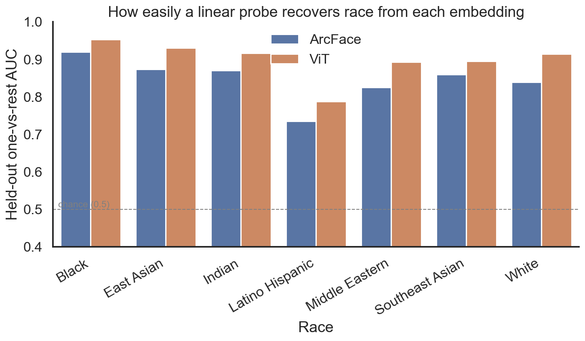
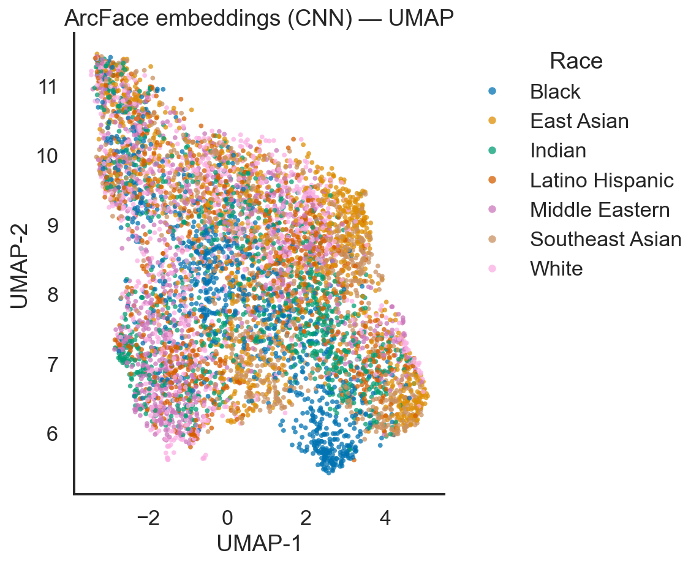
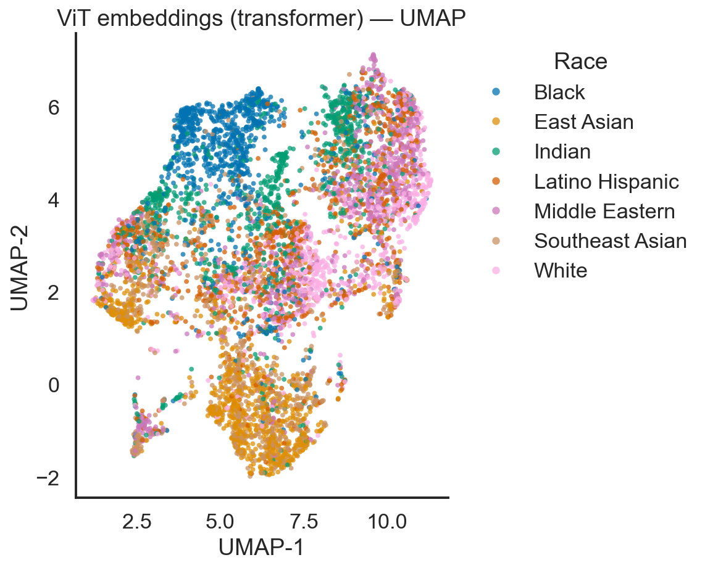
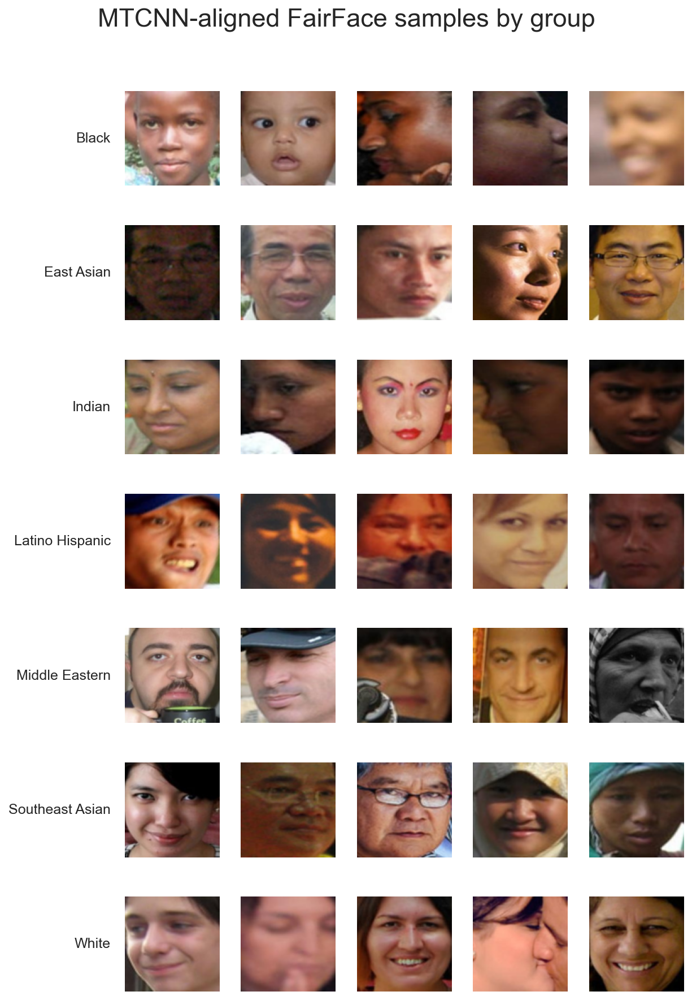

# Demographic Bias in Open-Source Face-Recognition Embeddings

**How much does *race* leak into the embeddings produced by popular off-the-shelf
vision models — and what does that mean for anyone deploying them?**

This project audits two widely used, freely available models — **ArcFace**
(a CNN purpose-built for face recognition) and **ViT-Base** (a general-purpose
vision transformer) — for demographic-attribute leakage, using a race-balanced
subset of the [FairFace](https://github.com/joojs/fairface) dataset. It pairs the
quantitative findings with the compliance stakes under **GDPR, CCPA, and the NIST
AI Risk Management Framework**.

> Originally completed for **EAI6400 (AI Ethics & Governance)** by Finn Pounds.
> Cleaned up and documented here for the public.

📄 **[Read the full report (PDF)](report/Demographic-Bias-Face-Embeddings.pdf)**

<p align="center">
  
</p>

---

## TL;DR

- A simple **linear probe recovers race from both models' embeddings** with
  held-out one-vs-rest AUCs of **~0.85 (ArcFace)** and **~0.90 (ViT)** — far above
  the 0.5 chance line. Neither model was trained to encode race; both do anyway.
- Leakage is **uneven across groups**: per-group AUC ranges from ~0.73 to ~0.95,
  meaning some demographics are substantially more inferable than others.
- The MTCNN face detector aligns faces at **>96% success for every group**, but
  even small disparities compound at deployment scale.
- **Takeaway:** "we never store race" is not a sufficient privacy claim when the
  embeddings you *do* store make race trivially recoverable. Bias measurement
  should be a standard pre-deployment step, not an afterthought.

---

## Why this matters

Open-source face models are a few `pip install`s away, which makes them easy to
drop into KYC/identity verification (finance), patient check-in (healthcare),
loyalty kiosks (retail), and site-access systems (energy/manufacturing). If the
embeddings these systems pass around encode protected attributes, an
organization can be processing special-category data — and exposed to disparate
impact — **without ever explicitly collecting it**:

- **GDPR Art. 9** restricts processing of racial/ethnic data without explicit
  consent or safeguards; embeddings that make race inferable can fall in scope.
- **CCPA** requires disclosure, minimization, and opt-out for biometric
  inferences.
- **NIST AI-RMF** calls for measuring and managing fairness risk before
  deployment — which is exactly what this repo demonstrates how to do.

---

## Method

```
FairFace subset (7,000 imgs, 1,000 × 7 groups)
        │
        ▼  MTCNN align + crop → 112×112
   aligned faces (6,821 kept)
        │
        ├──────────────► ArcFace (buffalo_l)  → 512-d unit-norm embedding
        └──────────────► ViT-Base (in21k)     → 768-d embedding (L2-normalized)
                                  │
                                  ▼
   Leakage metrics ── cosine gap · kNN · linear-probe AUC · held-out one-vs-rest AUC
   Geometry       ── within-race cosine similarity · UMAP projection
   Detector       ── per-group alignment keep-rate
```

**Models**
- **ArcFace / `buffalo_l`** via [InsightFace](https://github.com/deepinsight/insightface) —
  a CNN trained with additive-angular-margin loss to separate *identities*.
- **ViT-Base-Patch16-224-in21k** via
  [HuggingFace](https://huggingface.co/google/vit-base-patch16-224-in21k) —
  a transformer pretrained on ImageNet-21k, never tuned for faces. We use the
  `[CLS]` token as the embedding.

**Metrics**
| Metric | What it measures |
| --- | --- |
| **Cosine gap** | Mean within-race similarity − mean between-race similarity. Higher ⇒ more clustering by race. |
| **kNN accuracy (k=5)** | Can a neighbor vote predict race? Probes *local* structure. |
| **Linear-probe AUC** | How easily a logistic model separates each race. Probes *global, linear* structure. |
| **Held-out one-vs-rest AUC** | Same idea, but trained on 70% and scored on an unseen 30% (CV-tuned) — the honest number. |
| **Within-race cosine similarity** | How tightly each group clusters. |
| **Detector keep-rate** | Share of faces MTCNN successfully aligned, per group — a fairness check on the *pipeline*, not just the model. |

---

## Results

### Race is linearly recoverable from both embeddings

Held-out one-vs-rest AUC (train 70% / test 30%, stratified, L2-regularized probe):

| Group | ArcFace AUC | ViT AUC |
| --- | --- | --- |
| Black | 0.92 | 0.95 |
| East Asian | 0.87 | 0.93 |
| Indian | 0.87 | 0.92 |
| Latino Hispanic | 0.73 | 0.79 |
| Middle Eastern | 0.83 | 0.89 |
| Southeast Asian | 0.86 | 0.89 |
| White | 0.84 | 0.91 |
| **Macro average** | **0.85** | **0.90** |

> 0.5 = chance. Every group sits well above it. ViT — despite never being trained
> on faces — leaks *more* race information on average than the face-specialized
> ArcFace.

### Directional leakage summary

| Model | Cosine gap | kNN-5 acc. | Linear-probe AUC |
| --- | --- | --- | --- |
| ArcFace | 0.014 | 0.63 | 0.91 |
| ViT | 0.077 | 0.68 | 0.92 |

### The embeddings cluster by race

UMAP projections, colored by group — visible demographic structure in both spaces:

| ArcFace (CNN) | ViT (transformer) |
| --- | --- |
|  |  |

### Detector fairness

MTCNN alignment keep-rate stays in a tight **0.965–0.984** band across all seven
groups, so the upstream detector is not a major source of disparity here — the
leakage lives in the embeddings themselves.

### Sample aligned faces



Full numbers (regenerated on every run) live in
[`results/summary.md`](results/summary.md) and
[`results/metrics.json`](results/metrics.json).

---

## Reproduce it

```bash
# 1. Environment (Python 3.12)
python -m venv .venv && source .venv/bin/activate
pip install -r requirements.txt        # or requirements-lock.txt for exact pins

# 2. Download the balanced FairFace subset (~7,000 images)
python src/download_data.py            # writes to fairface_subset/

# 3. Run the full pipeline: align → embed → metrics → figures
python src/bias_pipeline.py            # caches embeddings to embed_cache.npz
python src/bias_pipeline.py --figures-only   # redraw figures from the cache
```

Outputs land in `figures/` and `results/`. First run downloads the ArcFace and
ViT weights (~600 MB, cached) and takes ~10–15 min on CPU.

The original exploratory analysis is in
[`notebooks/embedding_bias_analysis.ipynb`](notebooks/embedding_bias_analysis.ipynb);
`src/bias_pipeline.py` is the cleaned, reproducible version of that workflow.

### A preprocessing bug I caught while refactoring

While turning the notebook into the pipeline script, I found that the alignment
step was feeding **distorted images to both models**. `facenet-pytorch`'s MTCNN
defaults to `post_process=True`, which standardizes crops to roughly `[-1, 1]`;
the notebook then rescaled by `*255` and clamped to `[0, 255]`, which zeroed out
~47% of every crop's pixels and skewed its color balance before ArcFace or ViT
ever saw it. The race-leakage conclusion survived the bug (the distortion is
fairly consistent across faces), but the inputs were wrong. The pipeline here
sets `post_process=False` and drops the erroneous rescale, so the reported
figures and metrics come from **correct face crops**.

---

## Repository layout

```
.
├── src/
│   ├── bias_pipeline.py     # align → embed → metrics → figures (main entry point)
│   └── download_data.py     # fetch the balanced FairFace subset
├── notebooks/
│   └── embedding_bias_analysis.ipynb   # original exploratory notebook
├── report/
│   ├── Demographic-Bias-Face-Embeddings.pdf   # full written report
│   └── final-report.html    # report source (renders to the PDF)
├── web/
│   ├── index.html           # self-contained project page for a personal site
│   └── build_page.py         # regenerates it from figures + metrics
├── figures/                 # generated plots (UMAP, per-race AUC, sample grid)
├── results/                 # metrics.json + summary.md (generated)
├── requirements.txt         # core deps
├── requirements-lock.txt    # full pinned freeze for exact reproduction
└── README.md
```

The 7,000-image dataset, the model caches, and the `.venv` are **not** committed
(see `.gitignore`) — everything is regenerated by the two scripts above.

---

## Limitations & honest caveats

- **"Race" here is FairFace's 7-way annotation**, a coarse social construct, not
  ground truth about people. The point is leakage of a *labeled, sensitive
  attribute*, not an endorsement of these categories.
- 1,000 images/group is enough to show clear effects but is not a population
  sample; absolute numbers will shift with more data.
- We probe *linear* recoverability. Non-linear probes would likely find **more**
  leakage, so these figures are a lower bound on what's extractable.
- Findings describe these two checkpoints; other models will differ.

---

## Authors & citation

**Finn Pounds** — EAI6400, 2025.

If you reference this work:

```
Pounds, F. (2025). Demographic Bias in Contemporary Open-Source Facial
Recognition Embeddings (ArcFace, ViT). EAI6400 final project.
```

### Key references
- Deng et al. (2019). *ArcFace: Additive Angular Margin Loss for Deep Face Recognition.* CVPR.
- Dosovitskiy et al. (2021). *An Image is Worth 16×16 Words: Transformers for Image Recognition at Scale.* ICLR.
- Kärkkäinen & Joo (2021). *FairFace: Face Attribute Dataset for Balanced Race, Gender, and Age.* WACV.
- NIST (2023). *AI Risk Management Framework (AI RMF 1.0).*

## License

Code released under the [MIT License](LICENSE). The FairFace dataset and the
model weights are governed by their respective upstream licenses.
